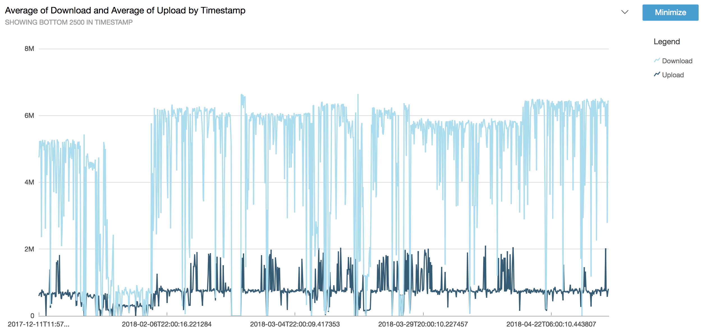

# speed-monitor
Runs speedtest regularly and uplaods the metrics to the cloud so they can be analysed with Aws QuickSight

I've set this up running in a RaspberryPi with the following cron tasks:

```
0 * * * * ~/speed-monitor-run.sh >~/speed-monitor-run.log 2>&1
30 5 * * * . $HOME/.profile; ~/speed-monitor-run.sh upload >~/speed-monitor-run-upload.log 2>&1
```

The first one is simply an hourly collection of speeds.
And the second one will summarise everything collected since the last upload and send it to the cloud. Please note that I got my `aws_access_key` and `aws_secret_access_key` in my `.profile`

And `speed-monitor-run.sh` is just a symlink to the file with the same name in the folder I git cloned this project.

# On the cloud

On my amazon account I got a S3 bucket on 'speed-monitor.s3.amazonaws.com'. And then I consume the data in QuickSight dashboard to see confirm how crappy my internet speeds are.

I'll try to find sometime to convert that small infra into a terraform/cloud formation script.



# Running as a container
docker run -e BUCKET_NAME='xxx' -e AWS_SECRET_ACCESS_KEY='xxx' -e AWS_ACCESS_ID='xxx' speed-monitor